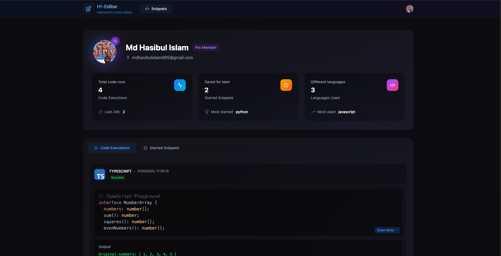

# Hi-Editor 🚀

<div align="center">
  <p><em>A modern, feature-rich, online code editor for multiple programming languages</em></p>
</div>

<div align="center">
  <a href="#features">Features</a> •
  <a href="#tech-stack">Tech Stack</a> •
  <a href="#getting-started">Getting Started</a> •
  <a href="#deployment">Deployment</a> •
  <a href="#screenshots">Screenshots</a> •
  <a href="#project-structure">Project Structure</a>
</div>

## Features

- ✨ **Modern UI** with responsive design using ShadcnUI and Tailwind CSS
- 🔍 **Multi-language Support** including JavaScript, TypeScript, Python, Ruby,
  Java, C++, and more
- 📊 **Real-time Code Execution** with instant feedback
- 💾 **Save Snippets** for future reference
- 🌐 **Share Code** with customizable links
- 👥 **User Authentication** with secure login
- 💸 **Premium Features** with Lemon Squeezy payment integration
- 💻 **Profile Page** to track and manage your code snippets and executions
- 🧩 **Comments and Collaboration** features

## Tech Stack

- **Frontend**: [Next.js 15](https://nextjs.org/) with React 19
- **Database & Backend**: [Convex](https://www.convex.dev/) for real-time
  database and serverless functions
- **Styling**: [Tailwind CSS](https://tailwindcss.com/) with
  [ShadcnUI](https://ui.shadcn.com/) components
- **Editor**: Monaco Editor with
  [Monaco-Editor-React](https://www.npmjs.com/package/@monaco-editor/react)
- **State Management**: [Zustand](https://github.com/pmndrs/zustand)
- **Authentication**: [Clerk](https://clerk.com/)
- **Payment Processing**: [Lemon Squeezy](https://www.lemonsqueezy.com/)
- **Type Safety**: TypeScript
- **Code Formatting**: Prettier, ESLint
- **Code Quality**: Husky, Commitlint

## Getting Started

### Prerequisites

- Node.js 18+
- npm, yarn, or pnpm

### Installation

1. Clone the repository

```bash
git clone https://github.com/yourusername/hi-editor.git
cd hi-editor
```

2. Install dependencies

```bash
npm install
# or
yarn
# or
pnpm install
```

3. Set up environment variables

```bash
cp .env.example .env.local
```

Edit `.env.local` with your Convex, Clerk, and Lemon Squeezy credentials. You'll
need to set up the following environment variables:

```env
# Clerk Authentication
NEXT_PUBLIC_CLERK_PUBLISHABLE_KEY=your_clerk_publishable_key
CLERK_SECRET_KEY=your_clerk_secret_key

# Convex Database & Backend
CONVEX_DEPLOYMENT=your_convex_deployment
NEXT_PUBLIC_CONVEX_URL=your_convex_url

# Lemon Squeezy Payment Integration
NEXT_PUBLIC_CHECKOUT_URL=your_lemon_squeezy_checkout_url
LEMON_SQUEEZY_WEBHOOK_SECRET=your_lemon_squeezy_webhook_secret
```

4. Start the development server

```bash
npm run dev
# or
yarn dev
# or
pnpm dev
```

5. Open [http://localhost:3000](http://localhost:3000) with your browser to see
   the result.

## Deployment

Hi-Editor is optimized for deployment on [Vercel](https://vercel.com).

```bash
npm run build
# or
yarn build
# or
pnpm build
```

### Setting Up Convex

1. Install Convex CLI

```bash
npm install -g convex
```

2. Initialize Convex

```bash
npx convex init
```

3. Deploy your Convex functions

```bash
npx convex push
```

## Screenshots

### Home Page

<div align="center">
  
  <p><em>The main editor interface featuring a split-pane layout with the code editor on the left and output panel on the right. Users can write code in multiple languages, run it, and see the results in real-time. The interface includes language selection, theme options, and quick access to all editor features.</em></p>
</div>

### Snippets Gallery

<div align="center">
  
  <p><em>Browse through a collection of saved code snippets from the community. Each card displays the snippet title, language, and a preview of the code. Users can filter by language, search for specific snippets, and click to view or fork any snippet.</em></p>
</div>

### Single Snippet View

<div align="center">
  
  <p><em>Detailed view of a single code snippet showing the full code with syntax highlighting, execution results, and creator information. Users can leave comments, star the snippet, or fork it to create their own version. Premium users can access additional features like private snippets and advanced execution options.</em></p>
</div>

### User Profile

<div align="center">
  
  <p><em>Personal profile dashboard displaying user information, activity statistics, and tabs for managing saved snippets and execution history. Users can track their coding progress, manage their content, and access their starred snippets for quick reference.</em></p>
</div>

### Pricing Plans

<div align="center">
  
  <p><em>Subscription options with Free and Pro tiers clearly outlined. The Pro plan offers advanced features like unlimited snippets, private sharing, priority execution, and advanced language support, all powered by Lemon Squeezy for secure payment processing.</em></p>
</div>

## Project Structure

```
hi-editor/
├── convex/            # Convex backend functions and schema
├── public/            # Public assets, images
├── screenshots/       # Project screenshots
├── src/
│   ├── app/           # Next.js application routes
│   │   ├── (root)     # Main application pages
│   │   ├── pricing    # Pricing page components
│   │   ├── profile    # User profile components
│   │   └── snippets   # Code snippets components
│   ├── components/    # Shared components
│   ├── hooks/         # Custom React hooks
│   ├── store/         # Zustand state management
│   ├── types/         # TypeScript type definitions
│   └── utils/         # Utility functions
├── .env.example       # Example environment variables
├── next.config.ts     # Next.js configuration
└── package.json       # Project dependencies
```

<div align="center">
  Made with ❤️ by Md Hasibul Islam Shanto
</div>
